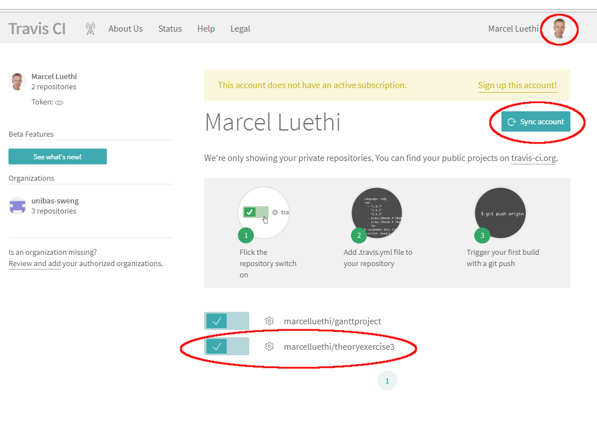

# Theorie&uuml;bung 3: Module und Abstrakte Datentypen

## Administratives

*Abgabe:* Individuelle Abgabe (als Textfile oder PDF) bis sp&auml;testens 24.10.2017 (23:59).

Zur Beantwortung der Fragen soll ein Textfile oder pdf erstellt werden, das auf [Courses](https://courses.cs.unibas.ch)  hochgeladen wird. Zus&auml;tzlich sollen sie f&uuml;r die &Auml;nderungen am Code einen Pull Request erstellen. 


## Einf&uuml;hrung
Das Ziel dieser &Uuml;bung ist die in der Vorlesung besprochenen Konzepte zum [Moduldesign](https://unibas-sweng.github.io/software-engineering/slides/04-module-design.html) und insbesondere 
zum wichtigen Konzept der [Abstrakten Datentypen (ADTs)](https://unibas-sweng.github.io/software-engineering/slides/04-module-categories.html) zu vertiefen und auch die praktische Umsetzung anzuschauen. 

Ausserdem werden wir auch sehen wie uns Unit Tests helfen k&ouml;nnen unsere Implementationen zu testen. 

## Vorbereitung

Erstellen sie auf Github einen Fork des Projekts [theoryexercise3](https://github.com/unibas-sweng/theoryexercise3). Klonen sie *ihren fork* mittels git 
```
git clone https://github.com/YOUR_USERNAME/theoryexercise3
```

Importieren sie das Projekt in Intellij Idea, indem sie die Datei ```build.gradle``` &ouml;ffnen. 

### Travis

Aktivieren sie Travis f&uuml;r dieses Projekt. Daf&uuml;r gehen sie auf [https://www.travis-ci.com](https://www.travis-ci.com), und loggen sie mit ihrem Github Account ein. Damit sie das neue Projekt sehen, m&uuml;ssen sie eventuell auf ihrer Accountseite (Symbol oben rechts) auf ```Sync account``` klicken (siehe Bild). Danach k&ouml;nnen sie Travis f&uuml;r das neue Projekt aktivieren, durch setzen des entsprechenden H&auml;kchens.
 

## Aufgabe 1: Implementation und Interface 
* Nennen sie einige Beispiele von Klassen in Ganttproject, wo das Interface separat von der Implementation definiert wurde.     
* Beschreiben sie kurz wie das Interface und die Implementation verwendet wird (d.h. wann wird die Implementation direkt angesprochen und wann das Interface). (Tip: Die Funktion ```Find Usages``` ist hier n&uuml;tzlich)
* Geben sie m&ouml;gliche Gr&uuml;nde an, weshalb dies so gemacht wurde. 


## Aufgabe 2: Errorhandling 

&Ouml;ffnen sie nun das Projekt ```theoryexercise 3``` in Idea. Sie finden im package ```errorhandling``` die Datei
```TextFileReader```. Die Methode ```readTextFile``` liest eine Textdatei und gibt den Inhalt als String zur&uuml;ck. Falls die Datei nicht gefunden wird, wird einen Exception geworfen. 

Seit Java 8 gibt es den Typ ```Optional```, der verwendet werden kann um anzuzeigen, dass eine Methode nicht immer einen validen R&uuml;ckgabewert hat. 

* Schreiben sie die Methode ```readTextFile``` so um, dass der Typ ```Optional``` verwendet wird. Passen sie auch die ```main``` Methode entsprechend an. (Vergessen sie nicht zuerst mit git einen branch ```exercise_3``` zu erstellen)
    * Committen sie ihre &Auml;nderung.
* Diskutieren sie was die Vorteile und Nachteile der jeweiligen Art von Errorhandling (also mit Optional oder Exception) sind. 
* Wann w&uuml;rden sie welche Methode einsetzen?
* Welche Methode ist ihrer Meinung nach hier besser geeignet?

## Aufgabe 3: Abstrakte Datentypen

Im Package ```adts``` finden sie 3 verschiedene Implementationen eines Stack als Abstrakten Datentyp. Eine Implementation ist wie man einen ADT in einer Imperativen Programmiersprache (wie z.B. C) implementieren w&uuml;rde, eine zweite zeigt eine typische Implementation in einer Funktionalen Programmiersprache und die dritte Implementation eine Typische Java Implementation. 

* Schauen sie sich die Unit Tests (in ```src/test/java/adts/...```) an um zu verstehen wie man mit diesem Stack arbeitet.
* F&uuml;hren sie die Unit Tests aus (rechtsklick auf Package ```src/test/java/adts```, dann ```run tests in adts```).
    * Es sollte alle Tests fehlschlagen.
* F&uuml;gen sie die fehlenden Implementationen hinzu bis alle Unit Tests korrekt funktionieren. 
    * Committen sie ihre &Auml;nderungen. Machen sie einen Pull request auf ihren master branch und f&uuml;gen sie ```silvanheller```, ```marvinbuff``` und ```marcelluethi``` als Reviewer hinzu. 
* Beantworten sie folgende Fragen:
    * Was wird beim ADT gekapselt und wie funktioniert diese Kapselung?     
    * Wie unterscheiden sich die verschiedenen Implementation bez&uuml;glich des Zustandsmanagements (also wie wird der Zustand des Stacks verwaltet)?
    * Weshalb erscheint uns die OO Version des Stacks am nat&uuml;rlichsten?
    * Wo sehen sie die Vorteile des OO Ansatzes gegen&uuml;ber dem funktionalen Ansatz? Wo hat der funktionale Ansatz Vorteile?


## Aufgabe 4: Module
Ab Java 9 (d.h. seit dem 21. September 2017) unterst&uuml;tzt Java nun auch Module. Informieren sie sich &uuml;ber dieses neue Feature, (indem sie zum Beispiel diesen [&Uuml;bersichtsartikel](https://labs.consol.de/development/2017/02/13/getting-started-with-java9-modules.html) lesen) und beantworten sie folgende Fragen:

* Welches Problem / welche Probleme l&ouml;st das neue Modulsystem?
* Was gibt man in der ```requires``` Klausel an?
* Was spezifiziert man mit der ```exports``` Klausel?
* Wann ist es sinnvoll eine ```uses``` und ```provides``` Klausel anzugeben?


